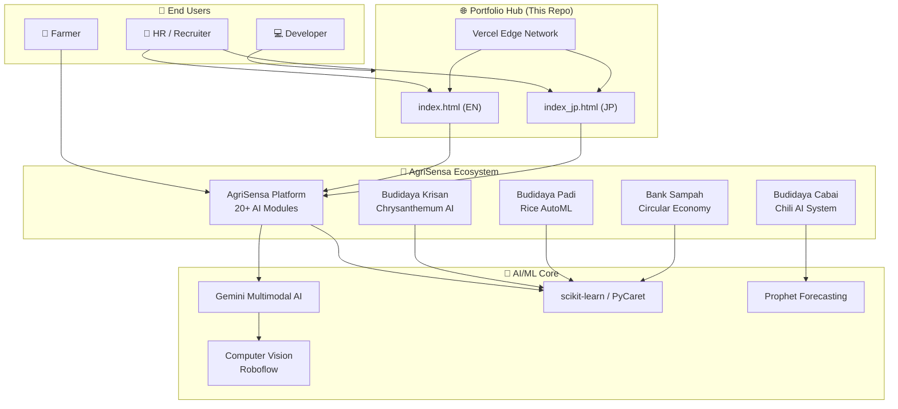

<div align="center">


# 👨‍💻 Andriyanto, BScE, S.E

**AI Product Engineer · AgriTech Innovator · Full-Stack Developer**

*Japan-Based | Global Remote Ready | Precision Agriculture Specialist*

[](https://agritech-portofolio.vercel.app)
[](https://agritech-portofolio.vercel.app/jp)
[](https://www.linkedin.com/in/andriyanto-na-147492157)
[](https://github.com/yandri918)
[](mailto:yandri918@gmail.com)

</div>

---

## 🎯 Who Am I?

I am an **AI Product Engineer** specialized in building end-to-end agricultural intelligence systems — from raw data collection to production-grade ML models to beautiful user interfaces. Based in Japan, I bring a unique combination of:

- 🧠 **Technical depth**: Multi-modal AI, AutoML, GIS & spatial analysis
- 🌾 **Domain expertise**: Precision agriculture, Indonesian farming systems, circular economy
- 🌍 **Global perspective**: Japan-based professional with APAC timezone advantage

> *"I don't just build models. I build platforms that transform how farmers make decisions."*

---

## 📊 Impact at a Glance

<div align="center">

| Metric | Value | Details |
|--------|-------|---------|
| 🌾 **Yield Increase** | **+15%** | Average improvement for active users |
| 💰 **Cost Reduction** | **-30%** | Via optimized fertilizer & pesticide use |
| 🤖 **AI Modules** | **60+** | Deployed across all platforms |
| 📱 **Applications** | **5** | Live in production |
| ⏱️ **System Uptime** | **99.5%** | Reliable, battle-tested deployments |
| 🔬 **Research Hours** | **500+** | Domain knowledge embedded into code |

</div>

---

## 🏗️ Platform Architecture



---

## 📁 Repository Structure

```
agritech_portofolio/
│
├── 📂 website/                  ← Portfolio website source code
│   ├── index.html               ← English version
│   ├── index_jp.html            ← Japanese version (日本語)
│   └── vercel.json              ← Deployment config (bilingual URL rewrites)
│
├── 📄 README.md                 ← You are here
├── 📄 DEPLOYMENT.md             ← Deployment history & notes
└── 📄 portfolio_jp.md           ← Notion-ready Japanese content
```

**Deployment Strategy:**
- `agritech-portofolio.vercel.app/` → English Portfolio
- `agritech-portofolio.vercel.app/jp` → Japanese Portfolio

---

## 🚀 Featured Projects

### 1. 🧠 AgriSensa Intelligence Platform
> *The flagship product — a comprehensive agricultural AI ecosystem*

[](https://mirai39.streamlit.app/)
[](https://github.com/yandri918/streamlit_terbaru)


**Tech Stack:** `Streamlit` `Gemini AI` `Roboflow CV` `Folium GIS` `Plotly` `scikit-learn`

| Feature | Description |
|---------|-------------|
| 🩺 AI Plant Doctor | Multi-modal disease diagnosis (image + text) |
| 🗺️ GIS Intelligence | Interactive soil & land use mapping |
| 🌦️ Smart Climate | Real-time weather + 7-day forecast |
| 🧪 NPK Calculator | Precision fertilizer recommendations |
| 🌿 Pesticide DB | Botanical & chemical pesticide encyclopedia |

---

### 2. 🌶️ Budidaya Cabai Platform
> *End-to-end chili farming management with AI advisory*

[](https://budidayacabe.streamlit.app/)
[](https://github.com/yandri918/budidaya_cabe_streamlit)

**Tech Stack:** `Streamlit` `Prophet` `Plotly` `Pandas`

- 💰 RAB (Budget) Calculator & planning
- 📈 Market price forecasting (ML)
- 🤖 AI Advisory System
- 📝 SOP & cultivation journal

---

### 3. 🌸 Budidaya Krisan — Chrysanthemum AI
> *AI-powered Japanese-style spray chrysanthemum cultivation*

[](https://budidayakrisan.streamlit.app/)
[](https://github.com/yandri918/budidaya_krisan)

**Tech Stack:** `Streamlit` `scikit-learn` `Altair` `Open-Meteo API`

- 🌱 Growth prediction engine (4–8 weeks ahead)
- ⚠️ Anomaly detection (Isolation Forest)
- 💡 Photoperiod calculator for artificial lighting
- 🌡️ Winter temperature management system

---

### 4. 🌾 Budidaya Padi — Rice Management
> *AutoML-powered rice farming with statistical analysis*

[](https://budidayapadi.streamlit.app/)
[](https://github.com/yandri918/budidaya_padi)

**Tech Stack:** `Streamlit` `PyCaret` `Statsmodels` `Altair`

- 🤖 PyCaret AutoML for yield prediction
- 🌾 20+ Indonesian rice varieties database
- 💧 AWD (Alternate Wetting & Drying) calculator
- 📊 ANOVA & RCBD statistical analysis

---

### 5. ♻️ Bank Sampah Terpadu — Waste Banking
> *Circular economy platform adapting Japanese waste sorting standards*

[](https://bank-sampah-terpadu.streamlit.app/)
[](https://github.com/yandri918/bank-sampah-terpadu)

**Tech Stack:** `Streamlit` `Plotly` `Pandas`

- ♻️ Japanese waste classification (moeru / shigen / moenai)
- 💵 "Trash to Cash" value calculator
- 📉 Real-time monitoring dashboard
- 🌱 Organic → compost / maggot feed pipeline

---

## 🧠 Tech Stack Overview

<div align="center">

| Layer | Technologies |
|-------|-------------|
| **AI / ML** | `Gemini AI` `scikit-learn` `PyCaret` `Prophet` `Roboflow` |
| **Data** | `Pandas` `NumPy` `Statsmodels` `Open-Meteo API` |
| **Visualization** | `Plotly` `Altair` `Folium` `Streamlit` |
| **Web** | `HTML5` `CSS3` `Glassmorphism` `Vercel` |
| **Languages** | `Python` `JavaScript` `SQL` |
| **DevOps** | `GitHub Actions` `Vercel CI/CD` `Streamlit Cloud` |

</div>

---

## 🌍 Why Global-Ready?

| Capability | Details |
|-----------|---------|
| 🗾 **Japan-Based** | Adapted to high-standard work ethics & APAC timezone |
| 🌐 **Bilingual Portfolio** | Full English + Japanese (日本語) version |
| 🏠 **Remote-First** | Proven delivery in async, distributed team environments |
| 🔄 **Full-Cycle** | Concept → Architecture → Development → Deployment |
| 💡 **ROI-Driven** | Every feature maps to measurable business value |

---

## 🚀 Running Locally

```bash
# Clone this repository
git clone https://github.com/yandri918/agritech_portofolio.git
cd agritech_portofolio/website

# Serve locally
python -m http.server 8080
# Open: http://localhost:8080
```

---

## 📬 Let's Connect

<div align="center">

[](https://www.linkedin.com/in/andriyanto-na-147492157)
[](https://github.com/yandri918)
[](mailto:yandri918@gmail.com)
[](https://agritech-portofolio.vercel.app)

</div>

---

<div align="center">
  
  <small>Built with ❤️ for Indonesian & Global Farmers | © 2026 Andriyanto, BScE, S.E</small>
</div>
